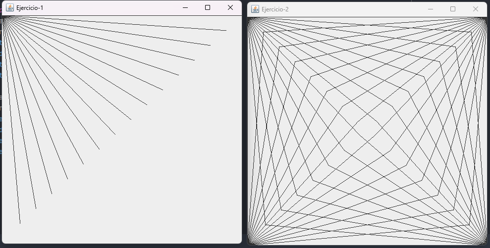
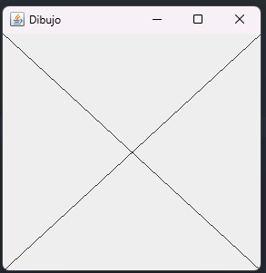
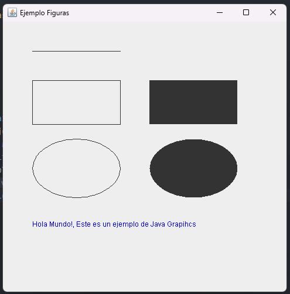

# Laboratorio 7 - Dibujo de Líneas en Java Swing

Este repositorio contiene un proyecto de Java que muestra cómo dibujar líneas en Java Swing utilizando dos clases personalizadas que extienden `JPanel` para representar diferentes patrones de líneas en una ventana de GUI.

## Contenido del Ejercicio

- **`Draw1.java`**: Esta clase extiende `JPanel` y dibuja un patrón de líneas diagonales en la ventana.

- **`Draw2.java`**: Esta clase también extiende `JPanel`, pero dibuja un patrón más complejo de líneas en la ventana.

- **`Main.java`**: Clase principal que crea dos instancias de las clases `Draw1` y `Draw2` y las muestra en dos ventanas separadas.

## Contenido de la app1

- **`Dibujo.java`**: Esta clase extiende `JPanel` y dibuja una `X` en la ventana.

- **`Main.java`**: Clase principal que crea una instancia de la clase `Dibujo` y lo muestra en ventana.

### Captura de Pantalla - app1

## Contenido de la app2

- **`EmjemploFiguras.java`**: Esta clase extiende `JPanel`, dibuja un `ovalo`, una `Linea Recta` y un `Rectangulo` tanto vacio como rellenado, tambien mustrando un mensaje en la ventana.

- **`Main.java`**: Clase principal que crea una instancia de la clase `Dibujo` y lo muestra en ventana.

### Captura de Pantalla - app2

